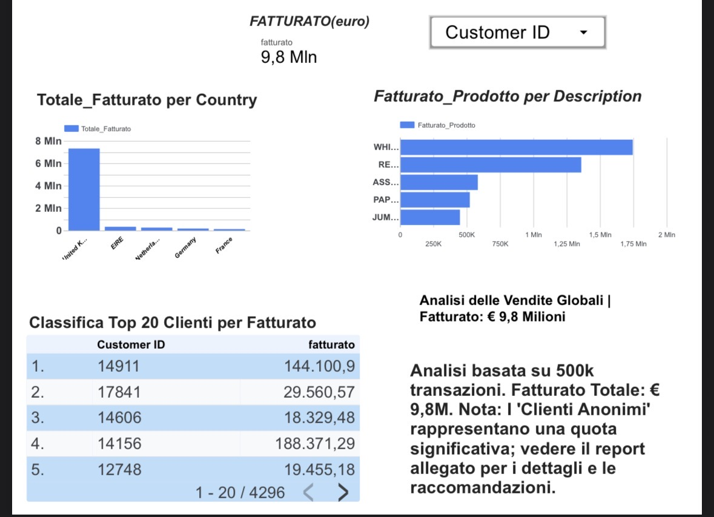

# Global Retail Sales Analysis - Strategic Data Engineering (€9.8M)

🔗 **[View Interactive Looker Studio Dashboard]([INSERISCI_IL_TUO_LINK_QUI](https://lookerstudio.google.com/reporting/d5f6a21d-996f-4675-b3d2-76d388514961))**

---

## Executive Summary (English)
**Turning 500k+ Raw Transactions into Strategic Profit**
* **Data Engineering Scale:** Processed **541,909 raw records** from an international retail enterprise. 
* **The Cleaning Process:** Used **Python (Pandas)** to eliminate **135,080 inconsistent rows** (25% noise reduction), resulting in a high-integrity dataset of **406,829 validated transactions**.
* **Architecture:** Implemented a **Relational SQL Model** to split the "dirty data" into three optimized tables: *Customers, Products, and Sales*.
* **Business Insights:** The analysis revealed a total revenue of **€9.8 Million**. 
* **Strategic Solution:** Identified that "Anonymous Customers" represent a massive revenue share. I proposed a **Lead Magnet Strategy** to Mr. Brown: offering digital interior design guides to capture emails and convert anonymous buyers into identified, loyal customers.

---

## 🇮🇹 Analisi Strategica e Ingegneria dei Dati (Italiano)
**Trasformare 500k+ Transazioni Grezze in Profitto Strategico**
* **Ingegneria dei Dati:** Analisi di **541.909 record grezzi**. 
* **Processo di Pulizia:** Utilizzo di **Python (Pandas)** per rimuovere **135.080 righe inconsistenti** (riduzione del 25% del rumore), isolando **406.829 transazioni validate**.
* **Architettura:** Progettazione di un **Modello Relazionale SQL** per dividere la "tabella sporca" in tre tabelle ottimizzate: *Clienti, Prodotti e Vendite*.
* **Risultati di Business:** L'analisi ha confermato un fatturato totale di **9,8 Milioni di Euro**.
* **Soluzione Strategica:** Ho rilevato che i "Clienti Anonimi" costituiscono una quota significativa delle vendite. Ho proposto a Mr. Brown una **Strategia di Lead Magnet**: l'invio di guide digitali sull'arredamento per catturare le email e trasformare gli acquirenti anonimi in clienti fidelizzati.

---

## 🇫🇷 Analyse Stratégique et Ingénierie des Données (Français)
**Transformer 500k+ Transactions Brutes en Profit Stratégique**
* **Ingénierie des Données :** Analyse de **541 909 enregistrements bruts**.
* **Nettoyage :** Utilisation de **Python (Pandas)** pour supprimer **135 080 lignes incohérentes** (réduction de 25% du bruit), isolant **406 829 transactions validées**.
* **Architecture :** Implémentation d'un **Modèle SQL Relationnel** pour diviser les données en trois tables optimisées : *Clients, Produits et Ventes*.
* **Résultats Business :** L'analyse a confirmé un chiffre d'affaires de **9,8 Millions d'Euros**.
* **Vision Stratégique :** J'ai identifié que les "Clients Anonymes" représentent une part importante du CA. J'ai proposé à Mr. Brown une **Stratégie de Lead Magnet** : offrir des guides déco numériques pour capturer les e-mails et fidéliser la clientèle.

---

## 🛠 Tech Stack
* **Python (Pandas):** Data cleaning & Wrangling.
* **SQL:** Database Architecture & Relational Modeling.
* **Looker Studio:** Data Visualization & Business Intelligence.
