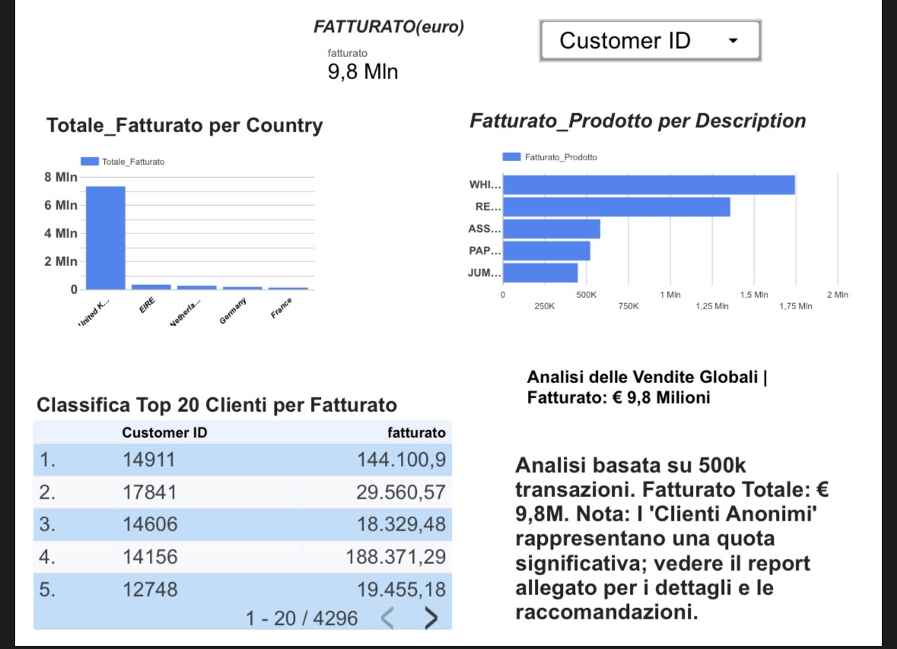

# Global Retail Sales Analysis - Strategic Data Engineering (€9.8M)

🔗 **[View Interactive Looker Studio Dashboard](https://lookerstudio.google.com/reporting/d5f6a21d-996f-4675-b3d2-76d388514961)**

---

## Executive Summary (English)
**From 541k Raw Records to Strategic Business Intelligence**
* **Data Engineering:** Processed **541,909 raw records**. I performed deep cleaning, removing over **135,000 inconsistent rows (25% noise reduction)**, resulting in **406,829 validated transactions**.
* **Analysis & Results:** Identified the **Top 5 Countries**, the **5 "Top Killer" Products**, and the **20 High-Value Customers** contributing to a total revenue of **€9.8 Million**.
* **The "Anonymous" Challenge:** Analysis revealed a high volume of anonymous sales. I proposed a **Lead Magnet & Newsletter Strategy** to Mr. Brown: offering value (interior design guides) in exchange for emails to track and convert anonymous buyers into loyal clients.
* **Final Datasets:** The repository contains the **validated CSV files**, organized into a normalized 3-table structure (Sales, Products, Customers) for high-performance database integration.

---

## 🇮🇹 Analisi Strategica e Ingegneria dei Dati (Italiano)
**Da 541k Record Grezzi alla Business Intelligence Strategica**
* **Data Engineering:** Ho elaborato **541.909 record grezzi**. Ho effettuato una pulizia profonda eliminando oltre **135.000 righe inconsistenti (riduzione del 25% del rumore)**, isolando **406.829 transazioni validate**.
* **Analisi e Risultati:** Ho estratto i **Top 5 Paesi**, i **5 Prodotti "Top Killer"** e i **20 Migliori Clienti** che hanno generato un fatturato totale di **9,8 Milioni di Euro**.
* **La Sfida dei "Clienti Anonimi":** L'analisi ha mostrato una perdita di dati preziosi a causa degli acquisti anonimi. Ho proposto a Mr. Brown una **Strategia di Lead Magnet & Newsletter**: offrire contenuti di valore (guide all'arredamento) per ottenere le email e trasformare i clienti anonimi in contatti fidelizzati.
* **Architettura Dati:** I risultati sono disponibili nei **file CSV ottimizzati**, strutturati in 3 tabelle normalizzate (Vendite, Prodotti, Clienti) pronte per l'integrazione in database professionali.

---

## 🇫🇷 Analyse Stratégique et Ingénierie des Données (Français)
**De 541k Enregistrements Bruts à l'Intelligence Stratégique**
* **Ingénierie des Données :** Traitement de **541 909 enregistrements**. Nettoyage de **135 000 lignes (réduction de 25%)** pour obtenir **406 829 transactions validées**.
* **Résultats :** Identification des **5 pays leaders**, des **5 produits "Top Killer"** et des **20 meilleurs clients** pour un CA de **9,8 M€**.
* **Stratégie :** Proposition d'une **Stratégie de Lead Magnet & Newsletter** pour convertir les clients anonymes en clients fidèles et identifiés.
* **Jeux de Données :** Les **fichiers CSV validés** sont disponibles dans le dépôt, organisés selon une structure normalisée pour une efficacité maximale.

---

## 🛠 Tech Stack
* **Data Cleaning & Engineering** | **Database Architecture** | **Looker Studio**
